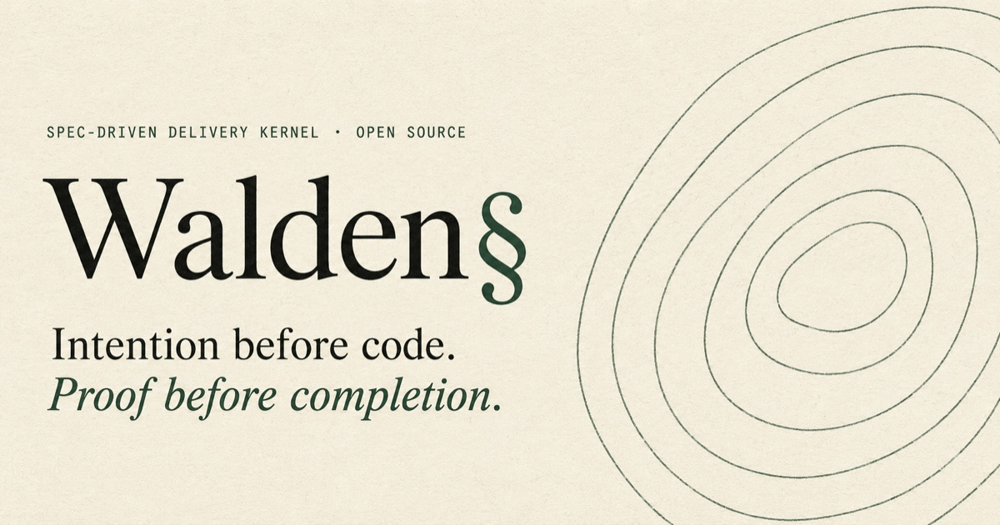

[](https://github.com/andrearaponi/walden/actions/workflows/go-test.yml)
[](https://github.com/andrearaponi/walden/releases)
[](https://go.dev)
[](LICENSE)
[](go.mod)

Walden is an open-source, spec-driven delivery kernel. It turns ideas into reviewed feature specifications and executes approved work through a deterministic, gated workflow.

<p align="center">
  
</p>

The core is a Go CLI that enforces phase order, freshness rules, verification proofs, and approval gates. An optional AI skill handles the non-deterministic half: drafting requirements, designing architecture, and reasoning about tradeoffs.

## What Walden Is

- A deterministic CLI for spec-driven delivery workflows
- A gated process: Requirements, Design, Tasks, Execute
- A clear boundary between what machines enforce and what humans (or AI) author
- Open-source core you can install, evaluate, and extend locally

## What Walden Is Not

- A complete enterprise platform (GitHub App, org dashboards, and governance pack are on the roadmap)
- A replacement for human review and approval
- A code generator — it structures the workflow, not the code itself

## How It Works

Every feature progresses through four phases. Each phase has an approval gate that must pass before the next begins.

```
Requirements ──▶ Design ──▶ Tasks ──▶ Execute
     │              │          │          │
  validate       validate   validate   verify
  review         review     review     proofs
  approve        approve    approve    complete
```

**Phase 1: Requirements** — What the feature must do. Expressed as [EARS](#ears) acceptance criteria with stable IDs (`R1.AC1`, `R1.AC2`).

**Phase 2: Design** — How it will be built. Architecture, component boundaries, alternatives considered, tradeoffs, and a requirement coverage matrix.

**Phase 3: Tasks** — What code to write, in what order. A two-level hierarchy where every leaf task references acceptance criteria IDs and includes a verification proof.

**Phase 4: Execute** — Build it. The CLI runs verification proofs and marks tasks complete only when proofs pass.

Phases cannot be skipped. Execution requires all three documents approved and fresh. If an upstream document changes after approval, downstream documents become stale and must be reconciled before work continues.

## Install

### One-Liner (Recommended)

```bash
curl -fsSL https://raw.githubusercontent.com/andrearaponi/walden/main/install.sh | sh
```

Downloads the latest release binary for your platform (darwin/linux, amd64/arm64), verifies its SHA-256 checksum, installs it to `~/.local/bin/walden`, and offers to install the AI skill for your coding agent. No Go toolchain, no clone.

Flags pass through the pipe with `sh -s --`:

```bash
curl -fsSL https://raw.githubusercontent.com/andrearaponi/walden/main/install.sh | sh -s -- --skill claude
```

| Flag | Effect |
| --- | --- |
| `--skill <agent\|all>` | Install the skill non-interactively (`claude`, `codex`, `copilot`, `opencode`, `all`) |
| `--version <tag>` | Install a specific release instead of the latest |
| `--no-verify` | Skip checksum verification (needed for releases ≤ v0.4.0, which predate `checksums.txt`) |
| `--uninstall` | Remove the skill (all agents) and the binary |

### Using the Setup Script

Building from a clone (contributors, unreleased changes):

```bash
git clone https://github.com/andrearaponi/walden.git
cd walden
./setup.sh
```

The setup script builds the binary, installs it to `~/.local/bin/walden`, and optionally installs the AI skill for Claude Code, Codex, Copilot, or OpenCode.

### From Source

```bash
go install github.com/andrearaponi/walden/cmd/walden@latest
walden skill install claude
```

Requires Go 1.25.0 or later. The skill ships inside the binary — `walden skill install` places it for your agent (`claude`, `codex`, `copilot`, `opencode`, or `--all`), always at the version matching the CLI.

### Build Locally

```bash
git clone https://github.com/andrearaponi/walden.git
cd walden
go build -o walden ./cmd/walden
```

### Verify

```bash
walden version
walden skill status
```

`walden skill status` reports where the skill is installed and whether it matches the binary's embedded copy.

### Update

```bash
walden update                    # update to the latest release and re-sync installed skills
walden update --check            # report what would change, write nothing
walden update --version v0.6.0   # pin a release, downgrade, or roll back
```

`walden update` downloads the release binary for your platform, verifies its SHA-256 checksum against the release's `checksums.txt` (fail-closed — there is no bypass), swaps the executable atomically, and smoke-tests the result, restoring the previous binary if the new one fails to run. It then reinstalls every skill installation it finds, so your agents pick up the embedded skill matching the new binary. Source builds (`walden version` reporting `dev`) refuse to update — rebuild from your clone instead. Networking stays confined to this one explicit command: no other command ever checks for updates or touches the network.

### Uninstall

```bash
curl -fsSL https://raw.githubusercontent.com/andrearaponi/walden/main/install.sh | sh -s -- --uninstall
```

From a clone, `./setup.sh uninstall` does the same. Or remove just the skill with `walden skill uninstall <agent>` (or `--all`).

## Quickstart

### 1. Install

```bash
curl -fsSL https://raw.githubusercontent.com/andrearaponi/walden/main/install.sh | sh
```

One command: the latest release binary lands in `~/.local/bin/walden` (checksum-verified) and the installer asks which coding agent gets the AI skill — Claude Code, Codex, Copilot, or OpenCode.

### 2. Open Claude Code and start building

```
We need to build a user authentication system. Let's design it with Walden.
```

That's it. The skill takes over from there.

It asks clarifying questions, drafts requirements in EARS format, designs the architecture, breaks the work into tasks with verification proofs, and walks you through execution — invoking the CLI at every step automatically.

You don't need to remember a single CLI command. `walden validate`, `walden review approve`, `walden task complete` — the skill calls all of it on your behalf, and the CLI enforces the rules.

---

**What the skill authors, what the CLI enforces:**

| The skill does | The CLI enforces |
| --- | --- |
| Asks the right questions | Phase ordering: Requirements → Design → Tasks → Execute |
| Drafts requirements in EARS format | Document freshness and approval chains |
| Designs architecture, evaluates alternatives | AC traceability (100% coverage required) |
| Generates implementation tasks with proofs | Verification proofs on every task |
| Reviews lessons before similar work | Stale document detection and reconciliation |

Human review and approval remain your responsibility. The skill drafts and proposes — it never approves on your behalf.

---

### Manual CLI workflow

If you prefer to drive the CLI directly:

```bash
walden repo init                                      # bootstrap .walden/
walden feature init user-auth                         # scaffold spec files
# edit requirements.md, design.md, tasks.md
walden validate user-auth                             # structural + EARS check
walden review open user-auth --phase requirements
walden review approve user-auth --phase requirements  # repeat for design, tasks
walden task start user-auth                           # get execution context
walden task complete user-auth 1.1                    # run proof, mark done
walden task complete-all user-auth                    # complete all in order
walden reconcile user-auth                            # repair stale chain
walden lesson log --feature user-auth --phase execute \
  --trigger "..." --lesson "..." --guardrail "..."
```

## Command Reference

| Command | Description |
| --- | --- |
| `repo init` | Bootstrap `.walden/` and `.github/` in the current repository |
| `feature init <name>` | Scaffold spec files for a new feature |
| `status <feature> [--json]` | Show current phase, blockers, and next action |
| `validate <feature> [--all] [--json]` | Validate spec documents for the current or all phases |
| `review open <feature> --phase <phase>` | Move a document to `in-review` |
| `review approve <feature> --phase <phase>` | Approve a document and record timestamps |
| `task status <feature> [--json]` | Check execution readiness and next runnable task |
| `task start <feature> [task-id] [--json]` | Get execution context for the next or a specific task |
| `task complete <feature> <task-id> [--json]` | Run verification proof and mark task complete |
| `task complete-all <feature> [--json]` | Complete all runnable tasks in order, stop on first failure |
| `verify <feature> [--all] [--check] [--json]` | Re-prove completed tasks against the current code and refresh evidence |
| `evidence status <feature> [--json]` | Report each task's derived execution-evidence state |
| `reconcile <feature> [--json]` | Repair stale approval chains after upstream edits |
| `lesson log [--json]` | Append a lesson to `.walden/lessons.md` |
| `version [--json]` | Print build version and schema version |
| `update [--check] [--version <tag>] [--json]` | Update the binary from GitHub releases and re-sync installed skills |

## Spec Model

### Documents

Every feature lives in `.walden/specs/{feature-name}/` with three files:

| Document | Purpose |
| --- | --- |
| `requirements.md` | Problem statement, user stories, EARS acceptance criteria, NFRs, constraints, out-of-scope |
| `design.md` | Architecture, component interfaces, options considered, failure modes, testing strategy, requirement coverage |
| `tasks.md` | Two-level task hierarchy with AC-level traceability and verification proofs |

### Frontmatter

Each document begins with YAML frontmatter that tracks its lifecycle:

```yaml
# requirements.md
---
status: draft | in-review | approved
approved_at:
last_modified: 2026-03-22T10:00:00Z
approved_fingerprint:
---
```

```yaml
# design.md
---
status: draft | in-review | approved
approved_at:
last_modified: 2026-03-22T10:00:00Z
approved_fingerprint:
source_requirements_approved_at:
source_requirements_fingerprint:
---
```

```yaml
# tasks.md
---
status: draft | in-review | approved
approved_at:
last_modified: 2026-03-22T10:00:00Z
approved_fingerprint:
source_design_approved_at:
source_design_fingerprint:
---
```

The `source_*` fields create an approval chain. When `walden review approve` approves a document, it records a SHA-256 **content fingerprint** of the approved body (`approved_fingerprint`) and, on downstream documents, the upstream's approval fingerprint (`source_*_fingerprint`). The timestamps remain as human-readable context; the fingerprints carry the verdict.

### Freshness

Freshness is decided by content identity, not by declared metadata:

- An approved document is **intact** when its current body still matches its own `approved_fingerprint`. Editing an approved document — without re-approval — makes it stale, no matter what its metadata claims.
- A downstream document is **fresh** when it is intact and its `source_*_fingerprint` equals the upstream's current `approved_fingerprint`. Re-approving an upstream document without changing its content does **not** stale the chain.
- Missing or malformed fingerprints on an approved document fail closed: the document is stale, with the cause named in the output (`stale_causes` in `--json`).

Fingerprint computation normalizes line endings and task checkbox state (checking a task off with `walden task complete` is execution progress, not a content change) and nothing else.

Stale documents block execution. Use `walden reconcile <feature>` to repair the chain: tampered or legacy documents reset to `draft`, stale downstream documents reset to `draft`, and re-approval records fresh fingerprints.

**Migrating from pre-fingerprint versions:** documents approved before fingerprints existed report stale (`approval fingerprint missing`). Run `walden reconcile <feature>` once and re-approve each phase; the chain comes back hardened.

### Requirement IDs

Requirements use stable, structured IDs:

| Type | Format | Example |
| --- | --- | --- |
| Functional requirement | `R{n}` | `R1`, `R2` |
| Acceptance criterion | `R{n}.AC{m}` | `R1.AC1`, `R1.AC2` |
| Non-functional requirement | `NFR{n}` | `NFR1`, `NFR2` |
| Constraint | `C{n}` | `C1`, `C2` |

Leaf tasks in `tasks.md` must reference acceptance criteria IDs (e.g., `R1.AC1`), not just parent requirement IDs. The validator verifies that every acceptance criterion from `requirements.md` is covered by at least one leaf task.

## Verification Proofs

Every leaf task includes a `Verification:` block. The CLI executes these proofs during `task complete` using `exec.Command` — no shell interpretation occurs unless explicitly requested.

### Structured Format

Use JSON arrays for exact argument control:

```markdown
- Verification:
  - command: ["go", "test", "-run", "TestAuth", "./internal/auth/..."]
```

### Expected Exit Code

For negative assertions (command must fail):

```markdown
- Verification:
  - command: ["grep", "-rq", "old_pattern", "."]
    expect_exit: 1
```

### Shell Operators

For pipes, `&&`, or globbing, use the Kubernetes shell pattern:

```markdown
- Verification:
  - command: ["sh", "-c", "test -d .walden && go test ./..."]
```

### Output Assertions

`expect_output` requires the step's combined output to contain the declared content — closing the vacuous-pass hole where a test command matching zero tests exits 0:

```markdown
- Verification:
  - command: ["go", "test", "-run", "TestAuth", "./internal/auth/"]
    expect_output: "--- PASS: TestAuth"
```

### Multi-Step Verification

Steps run in order, stopping on first failure:

```markdown
- Verification:
  - command: ["go", "build", "./..."]
  - command: ["go", "test", "./..."]
```

### Legacy Format (Deprecated)

Single-line format is deprecated. It does not support quotes, pipes, or shell operators, and the validator emits a deprecation warning when it encounters this format. Use the structured `command:` format instead.

```markdown
- Verification: go test ./...
```

## Evidence

Completing a task records durable execution evidence in `.walden/evidence/<feature>.json`: the proof's steps (argv, exit codes, output digests) bound to the approved chain fingerprints and to a **code identity** — a deterministic hash of the working tree with `.walden/` excluded, so committing the evidence never invalidates it. The checkbox in `tasks.md` stays the human-readable projection; the evidence document is the authoritative execution state, committed and reviewed like the specs it proves.

States are **derived at read time**, never stored:

| State | Meaning |
| --- | --- |
| `verified` | The recorded proof matches the current spec chain and the current code |
| `stale-spec` | Requirements, design, or this task's definition changed since the proof ran |
| `stale-code` | The working tree changed since the proof ran |
| `failed` | The last re-verification failed |
| `unrecorded` | Completed before the ledger existed (`walden verify` upgrades it) |
| `pending` | Not completed yet |

Re-prove the current code on demand:

```bash
walden verify <feature>          # re-run proofs for non-verified completed tasks
walden verify <feature> --all    # re-run every completed task's proof
walden verify <feature> --check  # report only — writes nothing (CI-friendly)
```

`walden evidence status <feature>` reports the derived states without running anything (always exit 0). Evidence writes replace the whole document atomically: concurrent walden processes can never corrupt the ledger — at worst a record is lost to the last writer, surfaces as `unrecorded`, and `walden verify` regenerates it. `walden task status` warns when completed tasks are no longer verified — a spec change or code change is visible as staleness instead of hiding behind a checked box. Timestamps in evidence records are human context only: every verdict depends exclusively on content identities.

## EARS

Walden uses the Easy Approach to Requirements Syntax (EARS) for all acceptance criteria. EARS eliminates ambiguity, vagueness, and complexity by constraining requirements to six well-defined forms.

| Form | Template | When to Use |
| --- | --- | --- |
| Ubiquitous | The system SHALL [response] | Always-active behavior |
| Event-driven | WHEN [trigger], the system SHALL [response] | Triggered by external event |
| State-driven | WHILE [precondition], the system SHALL [response] | Active while condition is true |
| Optional | WHERE [feature], the system SHALL [response] | Conditional on feature presence |
| Unwanted | IF [trigger], THEN the system SHALL [response] | Fault handling |
| Complex | WHILE [precondition], WHEN [trigger], the system SHALL [response] | Combined conditions |

Each acceptance criterion gets a stable ID (e.g., `R1.AC1`) and uses exactly one EARS form. DURING is accepted as an alias for WHILE per the original Mavin et al. paper. The CLI validates keyword-level structure: presence of a single SHALL, form classification by keyword position (WHEN, WHILE/DURING, WHERE, IF/THEN before SHALL), IF/THEN pairing, and non-empty template slots. It warns when EARS keywords appear after SHALL in ubiquitous-classified criteria (likely inverted form). It does not validate the semantic quality of content inside template slots.

### Enforcement Matrix

| Property | Enforced by CLI today | Planned |
| --- | --- | --- |
| Phase ordering | Yes | - |
| Freshness chain (content fingerprints) | Yes | - |
| Tamper detection on approved documents | Yes | - |
| AC ID traceability (task reference coverage) | Yes | - |
| EARS grammar validation (keyword shape) | Yes | - |
| Proof coverage per AC (via covers: field) | Yes | - |
| Proof execution | Yes | - |
| Structured proof format | Yes | Legacy deprecation active |

## Constitution

`.walden/constitution.md` is an optional repository-wide file that captures stable project context: tech stack, conventions, key files, and hard rules.

Unlike spec documents, the constitution:
- Is not part of the approval workflow
- Has no phase transitions or freshness rules
- Is not validated by the CLI

The AI skill reads it when present to reduce context rediscovery across features. Created by `walden repo init`.

## Lessons

`.walden/lessons.md` is an append-only log of reusable patterns. Each lesson records:
- **Trigger** — what happened
- **Lesson** — what went wrong or what pattern to avoid
- **Guardrail** — what to check next time

```markdown
### 2026-03-21T14:07:51Z | repo-init-and-review-flow | design
- Trigger: design constraints added after approval request
- Lesson: Workflow and toolchain constraints must be captured as explicit requirements before design approval.
- Guardrail: Before approving design, confirm delivery constraints are written into requirements.
```

The skill reviews lessons before non-trivial work to avoid repeating mistakes. Record lessons with `walden lesson log`.

## Skill

The optional AI skill handles non-deterministic authoring work while delegating all deterministic operations to the CLI:

| Skill does | CLI does |
| --- | --- |
| Draft requirements in EARS format | Validate document structure |
| Design architecture and evaluate alternatives | Enforce phase order and freshness |
| Generate implementation plans | Open and approve review gates |
| Interact with users during review | Execute verification proofs |
| Read constitution and lessons for context | Reconcile stale approval chains |

### Install the Skill

The skill is embedded in the binary — no repository clone or manual copying needed:

```bash
walden skill install claude      # or codex, copilot, opencode
walden skill install --all       # every supported agent at once
```

Installs are user-scoped by default (available across all your projects). For Claude Code and Codex you can install at project scope instead, so teammates get the skill by cloning the repository:

```bash
walden skill install claude --project
git add .claude/skills/walden/SKILL.md
```

Check installations and detect drift against the binary's embedded copy:

```bash
walden skill status
```

For agents Walden does not model yet, print the skill and place it yourself:

```bash
walden skill show > wherever/your/agent/loads/it.md
```

Claude Code auto-activates the skill when your request matches its description. Per-agent notes: `skill/walden/install-claude.md`, `install-codex.md`, `install-copilot.md`, `install-opencode.md`.

### Prerequisite

The `walden` binary must be installed and available in `PATH`. The skill will not fall back to manual frontmatter editing if the CLI is missing.

## JSON Contract

All `--json` commands return a versioned envelope:

```json
{
  "schema_version": "v0beta1",
  "command": "status",
  "ok": true,
  "result": { }
}
```

The schema version is `v0beta1` — a maturing contract: the shape is settling and you can build on it, but it may still change before the stable `v1` (which lands at v1.0.0). Match the `v0` prefix rather than the exact string; breaking changes are noted in the changelog.

When `ok` is `false`, the `result` contains error details. This contract enables machine-readable consumption by CI pipelines, scripts, and agent toolchains.

## Workflow Rules

- Phase order is strictly enforced: Requirements → Design → Tasks
- Execution requires all three documents approved and fresh
- Every leaf task must reference acceptance criteria IDs (e.g., `R1.AC1`), not just parent requirement IDs
- The validator verifies 100% task reference coverage — every acceptance criterion must appear in at least one leaf task
- Verification proofs are mandatory — tasks cannot be completed without a passing proof
- Stale documents must be reconciled before continuing
- Lessons are append-only and reviewed before similar future work
- Human review remains essential — the CLI enforces rules but never approves documents automatically

## Project Structure

```
cmd/walden/           CLI entrypoint
internal/
  app/                Command routing and handlers
  spec/               Document loading, parsing, frontmatter
  workflow/           State machine, review gates, execution
  validation/         Structural and traceability checks
  shell/              Command execution abstraction
  output/             Output formatting
  repo/               Repository bootstrap
templates/
  spec/               Spec document templates (requirements, design, tasks)
  repo/               Repository bootstrap templates (constitution, lessons, CI)
skill/walden/         AI skill bundle and install guides
docs/
  concepts.md         Core concepts and the two halves
  workflow.md         End-to-end workflow walkthrough
  boundaries.md       OSS core vs enterprise roadmap
  roadmap.md          Public and enterprise roadmap
examples/
  todo-app-demo/      Complete working example with shell verification
```

## Development

### Run Tests

```bash
go test ./...
```

### Engineering Standards

- **TDD-first** — new behavior starts with a failing test
- **Fail-fast** — commands reject blocked states before partial writes
- **Shell-safe verification** — structured `command` format via `exec.Command`, no implicit shell interpretation
- **Zero external dependencies** — pure Go standard library

### Contributing

See [CONTRIBUTING.md](CONTRIBUTING.md) for guidelines. For non-trivial changes, create a feature spec with `walden feature init` and follow the gated workflow.

## Roadmap

See [docs/roadmap.md](docs/roadmap.md) for the full roadmap. The open-source core is designed to work locally, in a single repository, with one developer or a small team. Enterprise capabilities (GitHub App, multi-repo sync, org dashboards) will build on top without changing the file model or CLI contract.

## On the Name

Walden is named after Thoreau's *Walden, or Life in the Woods*, where he writes:

> *"I went to the woods because I wished to live deliberately, to front only the essential facts of life."*

My grandfather taught me that principle before I had words for it: do fewer things, but do them with full attention. Software rarely does. This tool is an attempt to apply that discipline — to require intention before code, and proof before completion.

## License

Apache-2.0. See [LICENSE](LICENSE).
