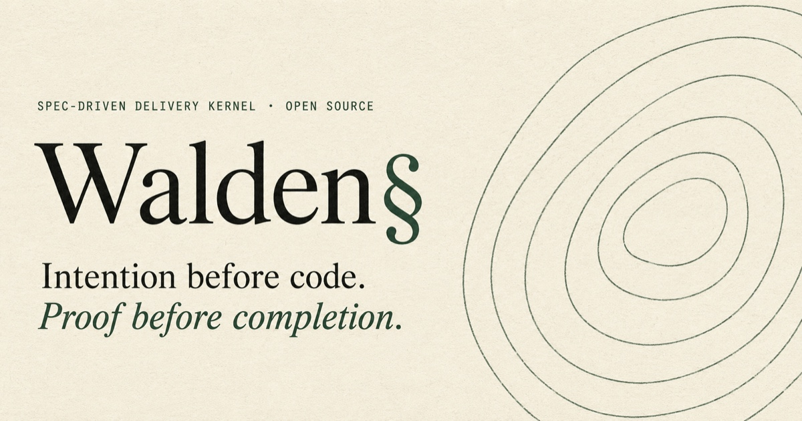

[](https://github.com/andrearaponi/walden/actions/workflows/go-test.yml)
[](https://github.com/andrearaponi/walden/releases)
[](https://go.dev)
[](LICENSE)
[](go.mod)
[](https://skills.sh/andrearaponi/walden)

Walden is an open-source, spec-driven delivery kernel: a deterministic CLI that takes a feature from intention to certified release through reviewed documents, executable proofs, and durable evidence.

<p align="center">
  
</p>

Most teams run Walden through a coding agent. The AI skill handles the non-deterministic half — asking clarifying questions, drafting requirements, designing architecture, planning tasks — and drives the CLI at every step. The CLI enforces the deterministic half: phase order, freshness fingerprints, verification proofs, execution evidence, and the release gate. You keep the judgment calls — nothing gets approved on your behalf.

## When to use Walden

Decide whether the intended contract changes before creating a specification:

| Contract impact | Route |
| --- | --- |
| Preserve or restore intended behavior | Use existing tests and refresh applicable evidence, without a new spec cycle unless the user or project rules require one. |
| Introduce or change intended behavior | Start a new feature at requirements, or revise the earliest affected phase of an existing spec. |
| Unclear | Clarify the intended behavior before choosing a lane or generating documents. |

Outside spec authoring does not mean outside testing, verification, or execution authorization. A planning approval alone never starts implementation.

## How It Works

Every feature progresses through four phases. Each phase has an approval gate that must pass before the next begins.

```
Requirements ──▶ Design ──▶ Tasks ──▶ Execute
     │              │          │          │
  validate       validate   validate   verify
  review         review     review     proofs
  approve        approve    approve    complete
```

Requirements are written as [EARS](docs/reference/spec-format.md) acceptance criteria with stable IDs; the design must cover every criterion; every leaf task carries an executable verification proof. Completing a task records durable evidence bound to the approved spec chain and to the code it proved. If anything changes after approval — a document, the code — staleness surfaces instead of hiding behind a checked box, and `walden release check` judges the declared feature or portfolio scope. Strict mode binds the actual spec/evidence inputs to the named commit. Legacy records retain explicit uncertainty; upgrading does not automatically replay historical plans.

## Inspect adoption before execution

`walden adopt <feature> --json` assesses existing Walden specs without executing proofs or environment probes. It reports task and declared-step workloads, keeping unavailable features separate from known zero.

After reviewing the scope, `walden adopt <feature> --apply` runs the applicable completed proofs. v0.12.0 adds task progress, measured durations, and complete failure/integrity diagnostics, including results that could not be saved. It does not waive untestable proofs, estimate historical runtime or change release guarantees. See [Brownfield Adoption](docs/adoption.md) and the [JSON contract](docs/reference/json.md#adoption-adopt---json).

## Keep the portfolio coherent

A long-lived repository accumulates specifications. `walden consolidate` counts the features whose approved requirements changed since the last consolidation, reminds you at two and three (warnings, never blockers), bounds the review to those features and the ones linked to them, and seals the outcome in a current-contract view, `.walden/contracts.md`, that the CLI checks against the specifications. See [Contract Consolidation](docs/consolidation.md).

## Install

Walden is two artifacts with one manager each: the **binary** comes from GitHub releases, the **AI skill** comes from the [Skills CLI](https://skills.sh). Neither installs the other.

### Binary

```bash
curl -fsSL https://raw.githubusercontent.com/andrearaponi/walden/main/install.sh | sh
```

Downloads the latest release binary for your platform (darwin/linux, amd64/arm64), verifies its SHA-256 checksum and installs it to `~/.local/bin/walden`. Flags pass through the pipe with `sh -s --`:

| Flag | Effect |
| --- | --- |
| `--version <tag>` | Install a specific release instead of the latest |
| `--no-verify` | Skip checksum verification (releases <= v0.4.0 have no checksums) |
| `--uninstall` | Remove the binary |

From source: `go install github.com/andrearaponi/walden/cmd/walden@latest`. Later, `walden update` upgrades the binary in place (checksum-verified, atomic). It changes one file: the executable.

### AI skill

```bash
npx skills add andrearaponi/walden --skill walden
```

Installs the guide project-level for the agents the Skills CLI detects (Claude Code, Codex, Copilot, OpenCode); add `--global` for a user-level copy, `--copy` for a committable file instead of a link. Update it with `npx skills update walden`. Details, scopes and removal: [skill/walden/install.md](skill/walden/install.md).

The current guide requires Walden CLI v0.10.4 or a newer compatible release. The skill **does not install the CLI**: if it is missing or incompatible, the skill stops, detects your platform and points you here, then you install the binary yourself and rerun. See the guide's [CLI Prerequisite](skill/walden/SKILL.md#cli-prerequisite) section.

Without Node, as a manual fallback (not a second channel): copy this repository's `skill/walden/` directory into your agent's skills directory, for example `~/.claude/skills/walden/`, and copy again when the guide changes.

### Windows

The POSIX installer does not run on Windows. Install from source with Go, or download the release asset:

```powershell
go install github.com/andrearaponi/walden/cmd/walden@v0.13.0   # then ensure %USERPROFILE%\go\bin is on PATH
```

or grab `walden-v0.13.0-windows-amd64.exe` (or `-arm64.exe`) from [GitHub releases](https://github.com/andrearaponi/walden/releases), rename it to `walden.exe` and place it on PATH. `walden update` refuses on Windows (a running `.exe` cannot replace itself): update with `go install` or by replacing the file.

## Quickstart

Install, then open your coding agent and say:

```
We need to build a user authentication system. Let's design it with Walden.
```

That's it. The skill asks clarifying questions, drafts requirements in EARS format, designs the architecture, breaks the work into tasks with verification proofs, and walks you through execution — invoking the CLI on your behalf at every step:

| The skill authors | The CLI enforces |
| --- | --- |
| Asks the right questions | Phase ordering: Requirements → Design → Tasks → Execute |
| Drafts requirements in EARS format | Document freshness and approval chains |
| Designs architecture, evaluates alternatives | Acceptance-criteria traceability (100% coverage) |
| Generates implementation tasks with proofs | Verification proofs on every task |
| Reviews lessons before similar work | Execution evidence bound to spec and code identity |

Human review and approval remain yours: the skill drafts and proposes — it never approves.

Prefer to drive the CLI directly? The [Quickstart](docs/quickstart.md) walks one real feature from `walden repo init` to a releasable verdict, command by command.

## Documentation

Full documentation lives in [docs/](docs/README.md) and on the [website](https://andrearaponi.github.io/walden/docs/).

- **Learn** — [Quickstart](docs/quickstart.md) · [The Agentic Flow](docs/agentic.md)
- **Understand** — [The Spec Lifecycle](docs/lifecycle.md) · [Product Boundaries](docs/boundaries.md)
- **Operate** — [The Daily Workflow](docs/workflow.md) · [Brownfield Adoption](docs/adoption.md) · [CI Integration](docs/ci.md)
- **Reference** — [CLI Commands](docs/reference/cli.md) · [JSON Contract](docs/reference/json.md) · [Spec File Format](docs/reference/spec-format.md)
- **Project** — [Roadmap](docs/roadmap.md) · [Changelog](CHANGELOG.md)

A complete working example lives in [examples/todo-app-demo](examples/todo-app-demo).

## Development

Pure Go standard library — zero external dependencies. Run the tests with `go test ./...`.

See [CONTRIBUTING.md](CONTRIBUTING.md) for guidelines. For non-trivial changes to Walden itself, create a feature spec with `walden feature init` and follow the gated workflow. This is a project-specific contribution policy; other repositories can route contract-preserving maintenance without a new spec cycle.

## On the Name

Walden is named after Thoreau's *Walden, or Life in the Woods*, where he writes:

> *"I went to the woods because I wished to live deliberately, to front only the essential facts of life."*

My grandfather taught me that principle before I had words for it: do fewer things, but do them with full attention. Software rarely does. This tool is an attempt to apply that discipline — to require intention before code, and proof before completion.

## License

Apache-2.0. See [LICENSE](LICENSE).
